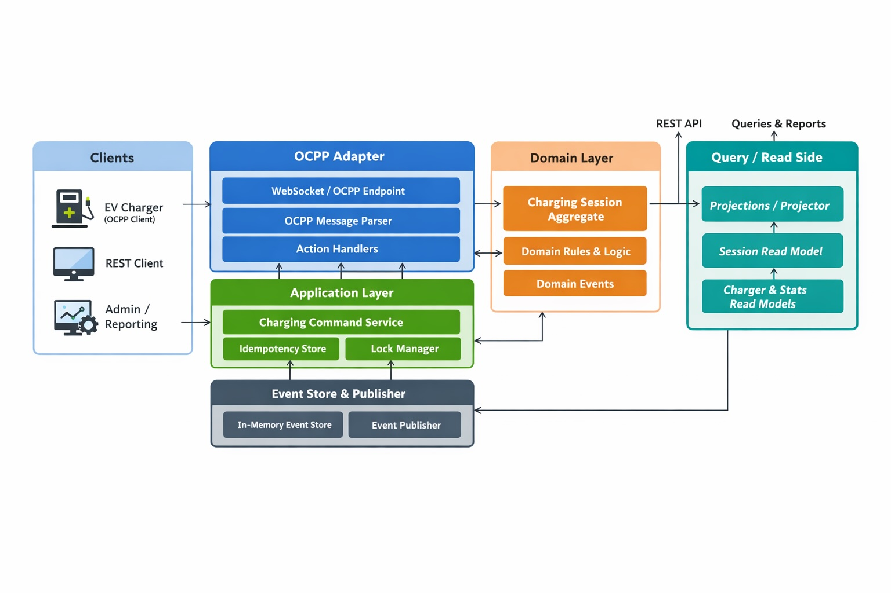

# OCPP Charging Service (EVRA)

Spring Boot 3 / Java 17 charging session service

## What is implemented
- Manual testing is done for the "happy-path"
- OCPP flow (ws) for the lifecycle transactions are working as expected
- Rest APIs are working as expected
- Unit test - Few more code to be added (I will update and confirm)
- Event sourcing is done (all events will list)
- Used CQRS 
- Idempotency is maintained 
- Data validation is done (did for few, and made as "can be added easily if required")
- Locking mechanis is done and tested
- Code structure is as per standards 


### Real transport layer for OCPP-style messages
This project now includes an actual HTTP/WebSocket transport entrypoint:

### Flow Architecture diagram


## Endpoints
WebSocket endpoint: 
- `ws://localhost:8082/ocpp/{chargerId}`

Supported actions:
- `BootNotification`
- `Authorize`
- `StatusNotification`
- `StartTransaction`
- `MeterValues`
- `StopTransaction`

### REST query APIs
- `POST /commands`
- `GET /sessions`
- `GET /sessions/{transactionId}`
- `GET /sessions/{transactionId}/events`
- `GET /chargers`
- `GET /chargers/{chargerId}/stats`


Incoming charger req frame follows OCPP CALL:
##### Example
```json
[2, "msg-001", "StartTransaction", {
  "connectorId": 1,
  "transactionId": "TX-555",
  "idTag": "TAG-001",
  "meterStart": 1200,
  "timestamp": "2026-03-01T10:00:00Z"
}]
```

The service flow:
- parses the frame 
- routes by OCPP action
- maps into internal command objects
- applies domain rules
- persists immutable events
- updates read models
- replies with OCPP CALLRESULT/CALLERROR frames.

## Architecture

### Write side
- OCPP WebSocket adapter or REST Model-x endpoint receives a command
- OCPP payload is mapped into `ChargingLifeCycle`
- `ChargingCommandService` checks idempotency
- a per-transaction or per-charger lock is acquired
- the event-sourced aggregate is rebuilt from prior events
- business rules are applied
- new domain event is appended to the event store (with idempotency)
- projection updates the query-side read model

### Read side
Read APIs query pre-projected read models only.

## Assumptions
1. `StartTransaction` payload accepts an optional `transactionId`.
   - If omitted, the backend generates one (UUID)
2. `MeterValues` payload is simplified to one `meterValue` field.
3. `StopTransaction` payload uses `meterStop`.
4. Idempotency for OCPP frames is derived as:
   - `ocpp-<chargerId>-<action>-<uniqueMessageId>`

This makes replay detection deterministic when the charger re-sends the same OCPP message ID.


This endpoint exists only to make local manual testing easier. The primary charger transport is the OCPP WebSocket endpoint.

## Build and run

### Prerequisites
- Java 17+
- Maven 3.9+

### Run tests
```bash
mvn clean test
```

### Start the application
```bash
mvn spring-boot:run
```

### Build jar
```bash
mvn clean package
java -jar target/ocpp-charging-service-1.0.0.jar
```

## Sample OCPP frames

### BootNotification
Client sends:
```json
[2, "boot-1", "BootNotification", {
  "connectorId": 1,
  "timestamp": "2026-03-21T10:00:00Z",
  "chargePointVendor": "EVRA",
  "chargePointModel": "Model-x"
}]
```

Server replies:
```json
[3, "boot-1", {
  "status": "Accepted",
  "currentTime": "2026-03-13T12:00:00Z",
  "interval": 300
}]
```

### StartTransaction
Client sends:
```json
[2, "start-1", "StartTransaction", {
  "connectorId": 1,
  "transactionId": "TX-555",
  "idTag": "TAG-001",
  "meterStart": 1200,
  "timestamp": "2026-03-02T10:00:00Z"
}]
```

Server replies:
```json
[3, "start-1", {
  "transactionId": "TX-555",
  "idTagInfo": {
    "status": "Accepted"
  },
  "message": "StartTransaction accepted (seq=1)"
}]
```

### MeterValues
Client sends:
```json
[2, "meter-1", "MeterValues", {
  "transactionId": "TX-555",
  "connectorId": 1,
  "meterValue": 1250,
  "timestamp": "2026-03-02T10:05:00Z"
}]
```

Server replies:
```json
[3, "meter-1", {
  "status": "ACCEPTED",
  "message": "MeterValues accepted (seq=2)"
}]
```

### StopTransaction
Client sends:
```json
[2, "stop-1", "StopTransaction", {
  "transactionId": "TX-555",
  "connectorId": 1,
  "meterStop": 1550,
  "timestamp": "2026-03-02T10:30:00Z"
}]
```

Server replies:
```json
[3, "stop-1", {
  "idTagInfo": {
    "status": "Accepted"
  },
  "status": "ACCEPTED",
  "message": "StopTransaction accepted (seq=7)"
}]
```

## Sample REST query responses

### `GET /sessions/TX-555`
```json
{
  "transactionId": "TX-555",
  "chargerId": "CHG-101",
  "meterStart": 1200,
  "meterEnd": 1550,
  "totalEnergyConsumedWh": 350,
  "startTime": "2026-03-02T10:00:00Z",
  "endTime": "2026-03-02T10:30:00Z",
  "durationSeconds": 1800,
  "status": "COMPLETED",
  "anomalies": [],
  "eventCount": 7
}
```

## How idempotency works

- Each incoming command includes or derives an idempotency key.
- The command handler checks the idempotency store before event emission.
- If the same key arrives again, the original result is returned and no new event is appended.

## Offline replay handling

The integration test covers this scenario:

- StartTransaction
- 3 meter values
- replay those same 3 meter values with the same idempotency keys
- 2 new meter values
- StopTransaction

Result:
- replayed messages do not create duplicate events
- final energy total remains correct

## Concurrency strategy

- Locks are scoped to either transaction ID or charger ID
- No global lock is used
- Event store, idempotency store, and read-model repositories use concurrency-safe structures

## Production evolution

The current abstractions are intentionally small so that they can be replaced later:

- `EventStore` -> PostgreSQL / Kafka / EventStoreDB
- `IdempotencyStore` -> Redis / database table
- `DomainEventPublisher` -> async broker publisher
- `LockManager` -> distributed lock implementation

## Package overview

```text
├── pom.xml
└── src
    └── main
        ├── java
        │   └── com
        │       └── evra
        │           └── ocppcharging
        │               ├── OcppChargingApplication.java
        │               ├── api
        │               │   ├── command
        │               │   └── query
        │               ├── domain
        │               │   ├── event
        │               │   ├── exception
        │               │   ├── lifecycle
        │               │   └── model
        │               ├── infrastructure
        │               │   ├── eventbus
        │               │   ├── eventstoer
        │               │   ├── idempotency
        │               │   ├── locking
        │               │   └── ocpp
        │               ├── query
        │               │   ├── model
        │               │   ├── projection
        │               │   └── repository
        │               └── services
        │                   ├── command
        │                   └── query
        └── resources
            └── application.yml
```
